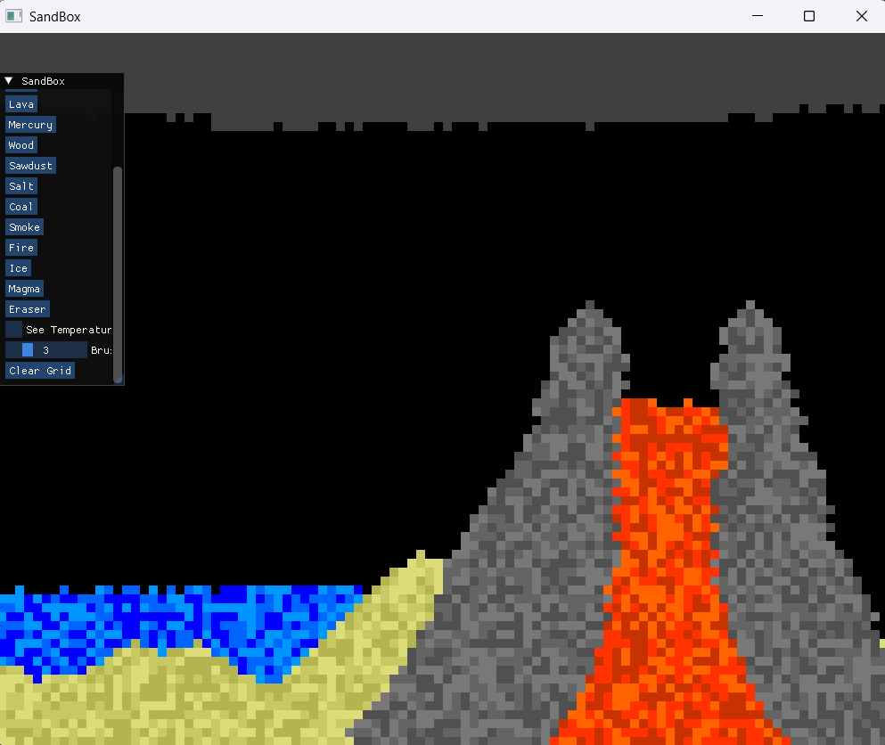
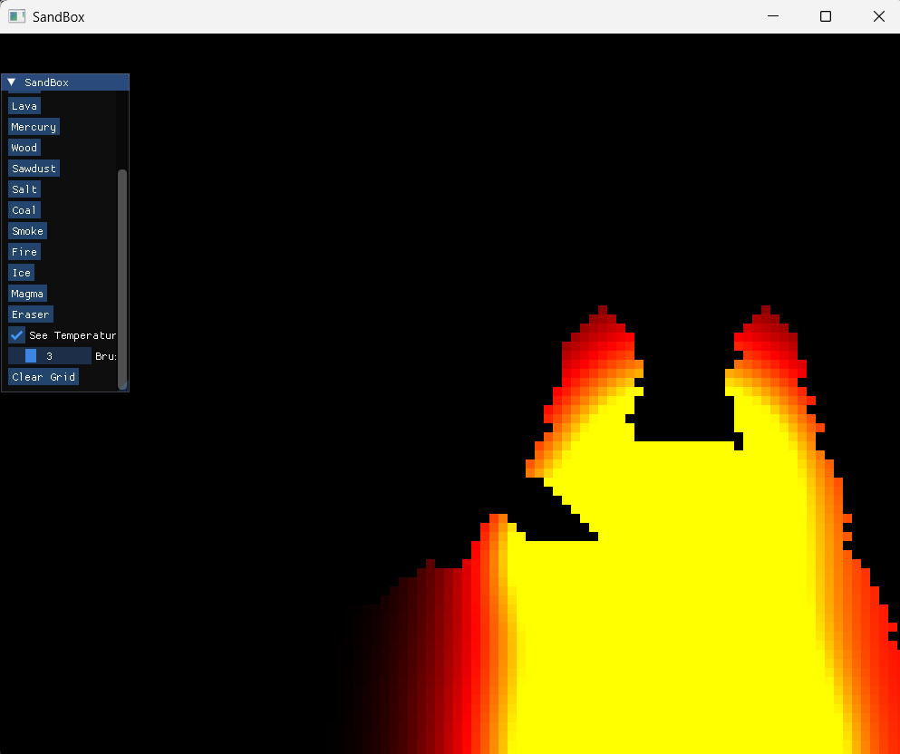

# Falling Sand Simulation

A real-time falling-sand simulation written in **C++** using **SFML**.

The simulation models different materials and their interactions, including gravity, fluid movement, temperature, and reactions.

## Features

*  **Sand simulation**

  * Falls downward under gravity
  * Can move diagonally when blocked

* **Water simulation**

  * Falls downward
  * Moves diagonally
  * Spreads horizontally

* **Acid**

  * Behaves similarly to water
  * Can interact with and consume other materials

* **Lava**

  * Has a high temperature
  * Can cool down and turn into stone

* **Ice**

  * Melts into water when heated

* **Smoke**

  * Rises upward
  * Can move diagonally and horizontally

* **Temperature simulation**

  * Materials exchange heat with neighboring cells
  * Temperature gradually changes over time
  * Materials can change type depending on their temperature

* **Interactive brush**

  * Place materials using the mouse
  * Adjustable brush size

* **Clear grid**

  * Quickly remove all materials from the simulation

## Materials

| Material | Behavior                                   |
| -------- | ------------------------------------------ |
| Air      | Empty cell                                 |
| Sand     | Falls and moves diagonally                 |
| Water    | Falls and spreads horizontally             |
| Acid     | Flows like water and reacts with materials |
| Smoke    | Rises through the grid                     |
| Lava     | Extremely hot and can become stone         |
| Ice      | Melts into water                           |
| Stone    | Solid material                             |

## Controls

| Input             | Action                       |
| ----------------- | ---------------------------- |
| Left Mouse Button | Place the selected material  |
| Clear Grid        | Remove all particles         |
| Brush Size        | Change the size of the brush |

Additional controls may depend on the current UI implementation.

## Simulation

The world is represented as a two-dimensional grid of cells.

Each cell stores information about its material and temperature. During each update, the simulation processes the cells and attempts to move them according to their material's behavior.

For example, water first attempts to move downward:

```text
  💧
  ↓
  .
```

If downward movement isn't possible, it attempts diagonal movement:

```text
💧   →   .
↓       ↘
█       💧
```

If those movements fail, water attempts to move horizontally.

The rendering system then rebuilds the vertex buffer from the current state of the grid.

## Rendering

The simulation uses `sf::VertexArray` with `sf::PrimitiveType::Triangles`.

Each cell is rendered as two triangles:

```text
0 ───── 1
│     / │
│   /   │
│ /     │
2 ───── 3
```

The vertex buffer is rebuilt each frame so that moved or deleted particles are correctly reflected on screen.

## Temperature

Materials have a temperature value that can affect their state.

Examples:

```text
Ice + heat → Water
Water + high temperature → Smoke
Lava + cooling → Stone
```

Temperature is also transferred between neighboring cells.

Normal:


With heat vision:


The exact structure may vary depending on the project setup.

## Requirements

* C++20 or newer
* SFML
* CMake

## Building

Configure and build with CMake:

```bash
cmake -B build
cmake --build build
```

Run the executable generated by the build system.

## Future Improvements

Possible improvements include:

* More materials
* Better fluid simulation
* Fire and combustion
* More complex material reactions
* Improved performance for larger grids
* Particle velocity
* More temperature-based reactions
* UI improvements
* Save/load simulation states

## License

This project can be used freely.
